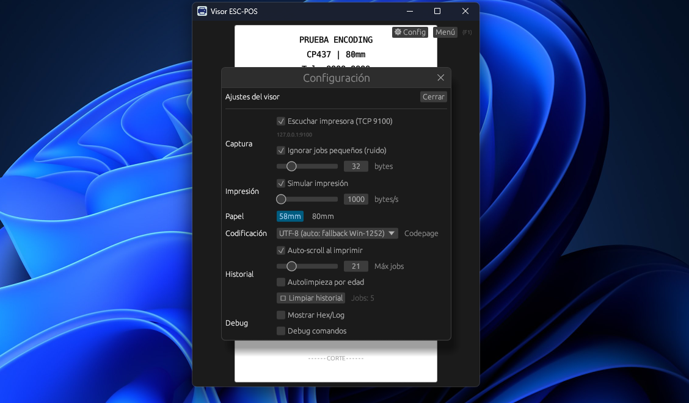
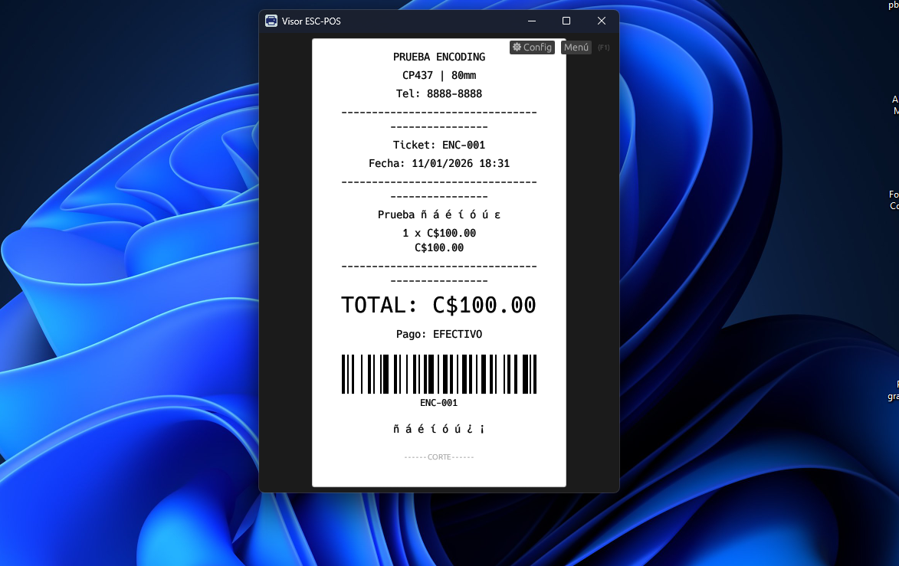
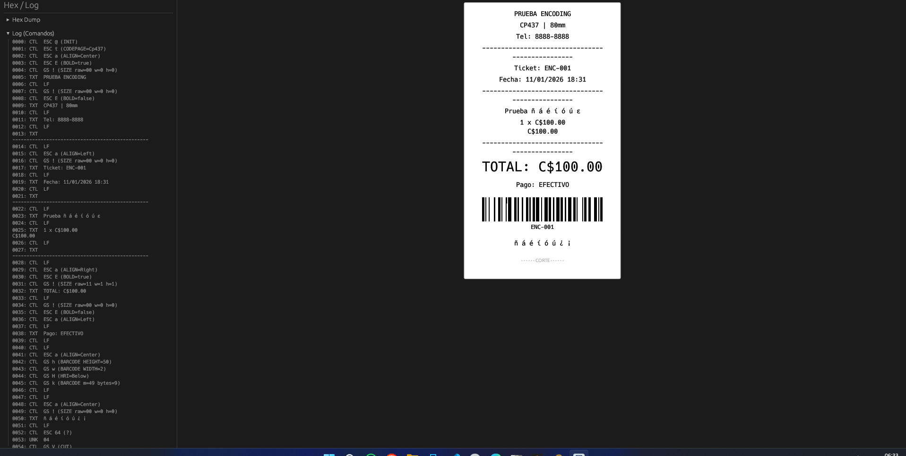

# Visor ESC-POS (escpos_viewer)

Visor de tickets ESC/POS multiplataforma (Windows **y** Linux). Captura trabajos de impresión por TCP (puerto 9100), los parsea y renderiza como ticket, con historial y herramientas de depuración.


---

## Características

- **Captura por TCP 9100** — recibe trabajos ESC/POS (RAW) en `127.0.0.1:9100`.
- **Modo Preview y Completo** — Preview enfocado en el ticket; Completo con controles, historial y debug.
- **Historial de trabajos** con pestañas por job.
- **Simulación de impresión** (revelado progresivo) y auto-scroll.
- **System Tray** (bandeja): ocultar/restaurar y auto-abrir al recibir un job.
- **Instancia única** — evita conflicto del puerto 9100.
- **Parser ESC/POS** con soporte para:
  - Texto, saltos de línea, negrita, alineación
  - Tamaño de texto (`GS ! n`)
  - Raster image (`GS v 0`)
  - QR (`GS ( k`)
  - Barcode (`GS k`) con render real (CODE128/EAN8/EAN13/ITF) y HRI (`GS H`)
  - Corte (`GS V`)
- **Codepage automático**: interpreta `ESC t n` (CP437/CP850/Windows-1252).

---

## Requisitos

**Windows 10/11** o **Linux** (X11/Wayland con tray icon).
Rust (stable): https://www.rust-lang.org/tools/install

### Linux — dependencias del sistema

```bash
sudo apt install libgtk-3-dev libxdo-dev
```

*Nota: `libgtk-3-dev` es necesario para el icono de bandeja (tray-icon). `libxdo-dev` se usa para interacción con ventanas.*

---

## Ejecutar

```bash
# En la raíz del proyecto
cargo run            # Arranca la GUI
cargo test           # Corre los 23 tests
```

El ejecutable compilado queda en `target/debug/escpos_viewer`.

### Flags (Windows)

```
--install-printer   Crea impresora virtual TCP 9100 (Admin)
--uninstall-printer Elimina la impresora virtual (Admin)
```

---

## Uso

### Captura por TCP 9100

1. Abre la app.
2. En `⚙ Configuración` activa **Escuchar impresora (TCP 9100)**.
3. Desde tu POS, imprime hacia una impresora TCP apuntando a `127.0.0.1:9100`.
4. Cada impresión crea un **Job** nuevo en el historial.

> Algunos POS envían "jobs pequeños" como consultas/ruido. Activa **Ignorar jobs pequeños (ruido)** para filtrarlos.

### Envío desde Node.js

Podés enviar tickets ESC/POS al visor desde Node.js usando la librería `node-thermal-printer`:

**1. Instalar dependencias:**

```bash
npm install node-thermal-printer
```

**2. Script de ejemplo:**

```js
import { ThermalPrinter, PrinterTypes, CharacterSet } from 'node-thermal-printer'
import { Socket } from 'node:net'

const printer = new ThermalPrinter({
  type: PrinterTypes.EPSON,
  interface: 'file:///dev/null',  // buffer, no impresora real
  width: 48,
  characterSet: CharacterSet.PC850_MULTILINGUAL,
})

// Layout del ticket
printer.alignCenter()
printer.bold(true)
printer.println('Ticket #101')
printer.bold(false)
printer.println('LA ESTRELLA 2')
printer.println('Cajero: xxxxx')
printer.newLine()
printer.alignLeft()
printer.println('Pista: FRA Vichy')
printer.println('Carrera: #2  02:55 PM')
printer.newLine()
printer.alignCenter()
printer.bold(true)
printer.println('Bs. 500,00')
printer.bold(false)
printer.printQR('https://app.xxxx.test/tickets/101', { cellSize: 4, correction: 'M' })
printer.println()
printer.alignLeft()
printer.println('Expira: 28/07/2026')
printer.println('Serial: 01kwn1n6...')
printer.newLine(3)
printer.cut()

// Enviar por TCP al visor
const buffer = printer.getBuffer()
const socket = new Socket()
socket.connect(9100, '127.0.0.1', () => {
  socket.write(buffer)
  socket.end()
  console.log('Ticket enviado al visor')
})
```

**3. Ejecutar:**

```bash
node ticket.mjs
```

> Asegurate de que escpos-viewer esté corriendo con "Escuchar impresora (TCP 9100)" activado.

**4. Guardar a archivo (sin visor):**

```js
import { writeFileSync } from 'node:fs'
writeFileSync('/tmp/ticket.bin', buffer)
```

### Abrir archivos

Abrí archivos `.prn`, `.bin` o `.txt` con comandos ESC/POS.

### Modos de UI

| Modo | Descripción |
|------|-------------|
| Preview | Solo el ticket, sin distracciones |
| Completo | Controles, historial, panels Hex y Log |

---

## Configuración (modal)

`⚙ Configuración` permite ajustar:

- Captura TCP (on/off, filtro de ruido)
- Simulación de impresión (velocidad bytes/s)
- Papel (58mm / 80mm)
- Codificación / Codepage (incluye auto por `ESC t`)
- Historial (auto-scroll, límites, autolimpieza)
- Debug (Hex/Log, debug de comandos)



---

## Impresora virtual (solo Windows)

El objetivo es poder imprimir desde cualquier software de Windows hacia una impresora `ESCPos Viewer (TCP 9100)` y que el visor capture los bytes por TCP.

### Automática (instalador)

El instalador Inno Setup lo intenta al finalizar. Si falla, seguí la guía: [docs/CONFIGURAR_IMPRESORA_TCP_9100.txt](docs/CONFIGURAR_IMPRESORA_TCP_9100.txt)

### Por comando (CLI)

```bash
escpos_viewer.exe --install-printer
escpos_viewer.exe --uninstall-printer
```

Requiere **Administrador**. Crea el puerto `ESCPosViewer9100` y la impresora con driver `Generic / Text Only`.

> El visor debe estar abierto con **Escuchar impresora (TCP 9100)** activado.

---

## Estructura

| Archivo | Rol |
|---------|-----|
| `src/main.rs` | Arranque, instancia única, argumentos CLI |
| `src/app.rs` | UI principal, historial, render de ticket |
| `src/escpos.rs` | Parser ESC/POS |
| `src/tcp_capture.rs` | Servidor TCP 9100, captura de jobs |
| `src/window_control.rs` | Control de ventana (Win32 **y** Linux con egui) |
| `src/tray.rs` | System Tray multiplataforma |
| `src/app_icon.rs`, `build.rs` | Icono embebido |

---

## Capturas

 | 
--- | ---

---

## Roadmap (ideas)

- Render de más tipos de barcode (UPC-A/UPC-E, Code39, Code93…)
- Word-wrap por palabras (títulos largos)
- Persistencia de configuración

---

## Licencia

MIT
